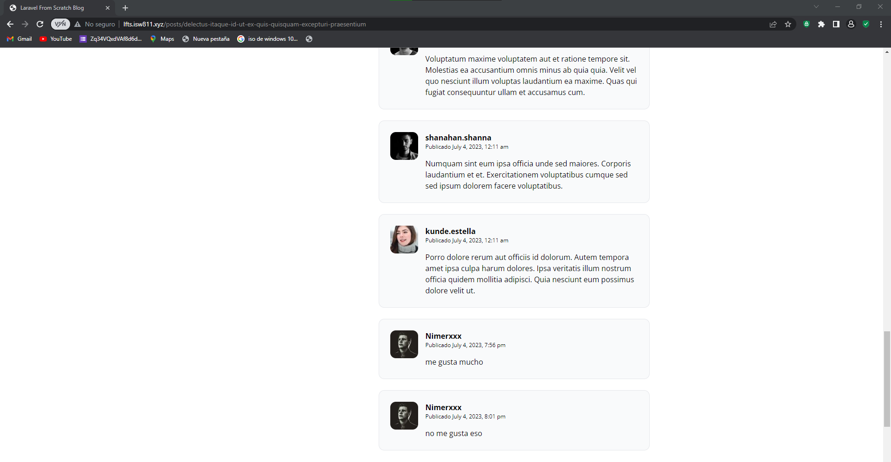

[< Volver al índice](/docs/README.md)

# Activar el formulario de comentarios
Vamos a darle funcionabilidad al sistema de comentarios

## 1 Crear un nuevo controlador llamado PostCommentsController

Ejecutar el siguiente comando desde la consola, raiz de proyecto.

```cmd
    php artisan make:controller PostCommentsController
```
## 2 En el archivo web crea la siguiente ruta.

```php
   Route::post('posts/{post:slug}/comments', [PostCommentsController::class, 'store']); 
```
las solicitudes dirigidas a la ruta posts/{post:slug}/comments, donde {post:slug} representa el slug de un post específico. Luego, el método store en el controlador PostCommentsController se encargará de procesar la solicitud y guardar el comentario asociado con ese post.

## 3 Crear el método store en el controlador anteriormente creado.
```php
        public function store(Post $post)
    {
        request()->validate([
            'body' => 'required'
        ]);

        $post->comments()->create([
            'user_id' => request()->user()->id,
            'body' => request('body')
        ]);

        return back();
    }
```
- Se valida la solicitud actual utilizando request()->validate([]). En este caso, se está validando que el campo 'body' de la solicitud no esté vacío. Si la validación falla

- Se utiliza la relación comments() del modelo Post para crear un nuevo comentario asociado al post. La llamada a $post->comments()->create([]) crea un nuevo registro en la tabla de comentarios relacionado con el post actual.

## 4 Verifica que no aparesca la seccion para comentar si la persona no esta logueada.


```php
 @auth
    <section></section>
  @else
  //redireccion al login o register  
 @endauth
```
### Quedaria de la siguiente forma

