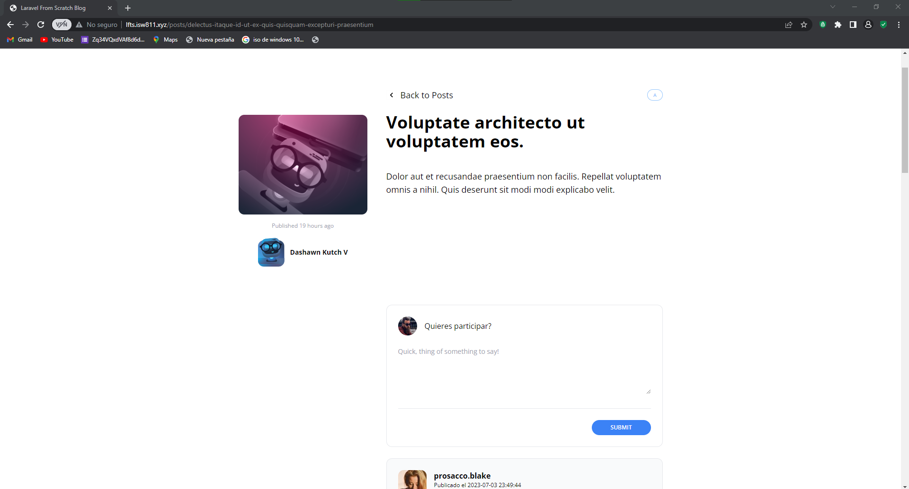

[< Volver al índice](/docs/README.md)

# Diseña el formulario de comentarios
Es importante tener la forma de enviar comentarios por ello vamos a diseñar un formulario que se encargue del sistema de mensajes.

## En la vista show vamos a crear un formulario con la siguiernte estructura.

```php
                        <form action="#" method="post">
                        @csrf
                        <header class="flex items-center">
                            id() }}"
                                alt=""                              
                                width="40"
                                height="40"
                                class="rounded-full">
                            <h2 class="ml-4">Quieres participar?</h2>
                        </header>
                        <div class="mt-6">
                            <textarea
                                name="body"
                                class="w-full text-sm focus:outline-none focus:ring"
                                rows="5"
                                placeholder="Quick, thing of something to say!"
                                required></textarea>
                        </div>

                        <div class="flex justify-end mt-6 pt-6 border-t border-gray-200">
                            <button class="bg-blue-500 text-white uppercase font-semibold text-xs py-2 px-10 rounded-2xl hover:bg-blue-600" type="submit">Submit</button>
                        </div>

                    </form>
```


## 2 Vamos a crear un componente llamdo panel el cual es un div que encapsula el form y le de diseño

```php
<div {{ $attributes(['class' => 'border border-gray-200 p-6 rounded-xl']) }}>
    {{ $slot }}
</div>
```
Se debe implementar de la siguiernte forma
```php
    <x-panel>
        <form></form>
    </x-panel> 
```
### Quedaria de la siguiente forma

