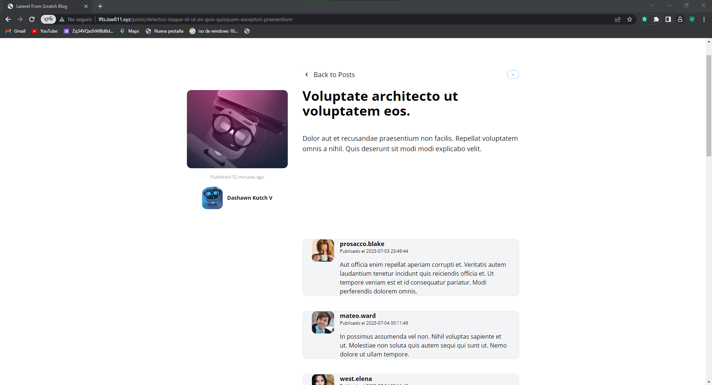

[< Volver al índice](/docs/README.md)

# Haz que la sección de comentarios sea dinámica
Es muy importante que los comentarios sean cargados de la base de datos por ello lo vamos a implementar

## 1 En el modelo del posts debemos agregar el siguiente codigo 
```php
        public function comments()
    {
        return $this->hasMany(Comment::class);
    }
```
la función comments() en el modelo de Post establece la relación de "uno a muchos" entre los modelos de Post y Comment, permitiendo acceder a los comentarios asociados a un post determinado.


## 2 En el modelo del comments debemos agregar el siguiente codigo 

```php
    public function post()
    {
        return $this->belongsTo(Post::class);
    }
    public function author()
    {
        return $this->belongsTo(User::class,'user_id');
    }
```
Estas funciones definen relaciones de pertenencia entre el modelo de Comment y los modelos de Post y User respectivamente. Estas relaciones permiten acceder al post al que pertenece un comentario utilizando el método post() y al autor (usuario) del comentario utilizando el método author().

## 3 Implementacion de propiedades en el componente post-comment
gracias a esto se va a poder cargar por medio de propiedades los comentarios de la base de datos.
```php
   @props(['comment'])
<article class="flex bg-gray-100 border border-gray-200 px-6 rounded-xl space-x-4">
    <div class="flex-shrink-0">
        id}}" width="60" height="60" style="max-width: 100px;" alt="auto">                          
        </div>
    <div>
    <header class="mb-4">
            <h3 class="font-bold">{{$comment->author->username}}</h3>

            <p class="text-xs">Publicado el  <time>{{$comment->created_at}}</time> </p>                              
    </header>
        <p>
            {{$comment->body}}
        </p>
    </div>
</article> 
```
### Quedaria de la siguiente forma
