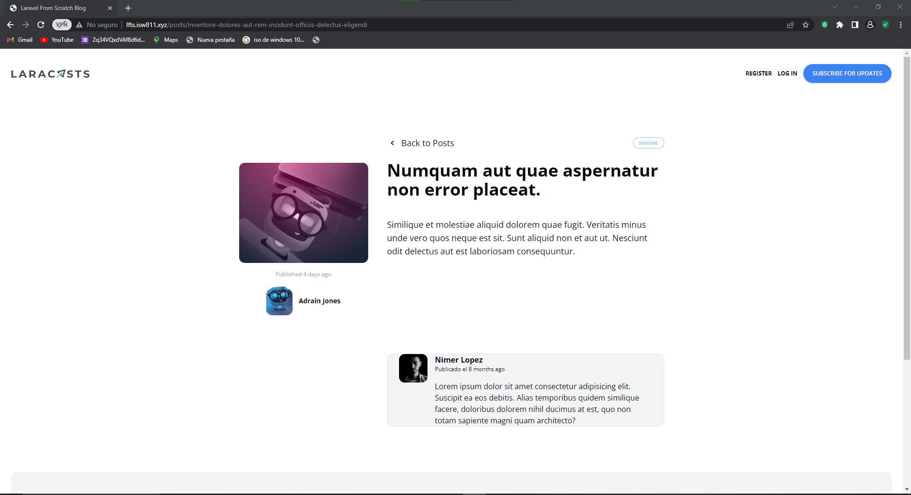

[< Volver al índice](/docs/README.md)

# Escribir el marcado para un comentario de publicación

escribir el marcado adecuado para un comentario de publicación es importante porque mejora la accesibilidad, la legibilidad y la mantenibilidad de tu sitio web. Además, proporciona una estructura clara y significativa que ayuda a los usuarios.

## 1 En la vista show implementa el siguiernte codigo
```php
    <section class="col-span-8 col-start-5 mt-10 space-y-6">
        <x-post-comment/>
    </section>
```


## 2 Creamos un nuevo componente con el siguiernte codigo

```php
    <article class="flex bg-gray-100 border border-gray-200 px-6 rounded-xl space-x-4">
    <div class="flex-shrink-0">
                                  
        </div>
    <div>
    <header class="mb-4">
            <h3 class="font-bold">Nimer Lopez</h3>

            <p class="text-xs">Publicado el  <time>8 months ago</time> </p>                              
    </header>
        <p>
            Lorem ipsum dolor sit amet consectetur adipisicing elit. Suscipit ea eos debitis. Alias temporibus quidem similique facere, doloribus dolorem nihil ducimus at est, quo non totam sapiente magni quam architecto?
        </p>
    </div>
</article>
```
Unas ves echo esto tendras en la parte inferior un comentario del autor junto a la fecha

### Quedaria de la siguiente forma
