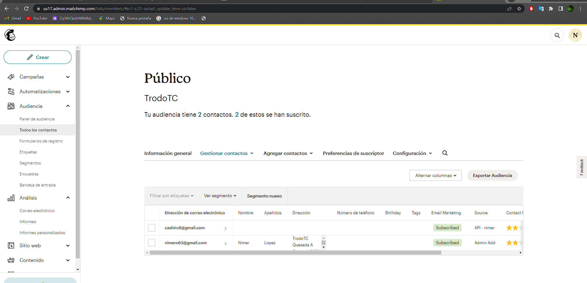

[< Volver al índice](/docs/README.md)

# Ajustes de la API de Mailchimp

Agregar miembros a una lista en Mailchimp es importante porque permite construir y mantener una base de datos de contactos para tus campañas de marketing por correo electrónico. Al agregar miembros a una lista, puedes enviarles correos electrónicos relevantes, promociones, actualizaciones y otro tipo de contenido.

## 1 Crearse un cuenta y generar una key en la siguiente pagina.
[Mailchimp](https://mailchimp.com/)


## 2 En la Parte final del archivo .env agrega la key

```php
    MAILCHIMP_KEY=4bceaec527428c2b2017032980175e4b-us17
```
## 3 En el archivo services agrega el siguiernte codigo
```php
        'mailchimp' => [
        'key' => env('MAILCHIMP_KEY'),
    ],
```
Gracias a esto vas a poder llamar esa key para usarla en tu programa.


## 4 genera una ruta get en el archivo web.

```php
Route::get('ping',function () {
    $mailchimp = new \MailchimpMarketing\Apiclient();
    $mailchimp->setConfig([
      'apiKey'=> config('services.mailchimp.key'),
      'server'=>'us17'
    ]);
    $response = $mailchimp->lists->addListMember('ab21b4a70e',[
      'email_address'=>'cashiro9@gmail.com',
      'status'=>'subscribed'
    ]);
    ddd($response);
 });
```
- \MailchimpMarketing\Apiclient(). Esta clase es parte de la biblioteca oficial de Mailchimp para PHP, que permite interactuar con la API de Mailchimp.

- Se llama método setConfig() en la instancia de $mailchimp para configurar los valores de la API key y el servidor de Mailchimp. La clave de la API se recupera de la configuración del servicio Mailchimp definida en el archivo de configuración de Laravel (probablemente config/services.php). En este caso, también se establece el servidor en 'us13'.

- Se llama al método addListMember() en la propiedad $mailchimp->lists. Este método agrega un nuevo miembro a una lista de Mailchimp. En este caso, se pasa la ID de la lista como primer argumento ('d3c0c14060') y un arreglo asociativo como segundo argumento, que contiene la dirección de correo electrónico del nuevo miembro y el estado de suscripción ('subscribed' indica que el miembro está suscrito).

### Quedaria de la siguiente forma

