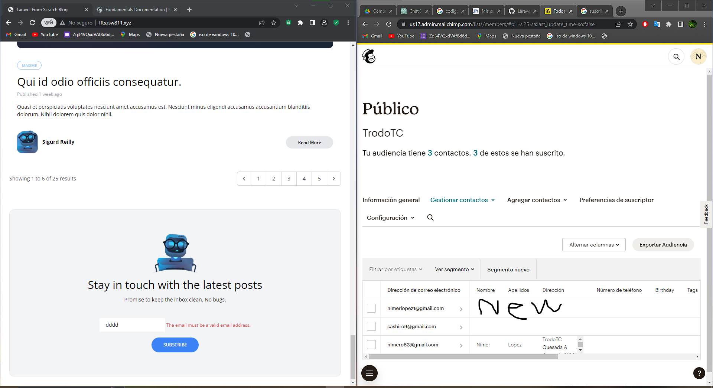

[< Volver al índice](/docs/README.md)

# Hacer que el formulario de boletín funcione

## 1 Vamos a modificar la ruta creada anteriormente.
Le vamos a cambiar el nombre, ahora no va a ser un get si no un potst con su respectiva validacion para que solo admita correos validos y que se guarde el correo escrito por el usuario.

```php
  Route::post('newsletter', function () {
  request()->validate(['email' => 'required|email']);
  
  $mailchimp = new \MailchimpMarketing\Apiclient();
  $mailchimp->setConfig([
      'apiKey' => config('services.mailchimp.key'),
      'server' => 'us17'
  ]);
  try {
    
  $response = $mailchimp->lists->addListMember('ab21b4a70e', [
      'email_address' => request('email'),
      'status' => 'subscribed'
  ]);
}catch(Exception $e){
  throw ValidationException::withMessages([
    'email' => 'This email could not be added to our newsletter list.'
]);
}  
```


## 2 Modifica el formulario de Suscripción 

```php
    <form method="POST" action="/newsletter" class="lg:flex text-sm">
                        @csrf

                        <div class="lg:py-3 lg:px-5 flex items-center">
                            <label for="email" class="hidden lg:inline-block">
                                
                            </label>

                            <div>
                                <input id="email" name="email" type="text" placeholder="Your email address"
                                    class="lg:bg-transparent py-2 lg:py-0 pl-4 focus-within:outline-none">

                                @error('email')
                                <span class="text-xs text-red-500">{{ $message }}</span>
                                @enderror
                            </div>
                        </div>

                        <button type="submit"
                            class="transition-colors duration-300 bg-blue-500 hover:bg-blue-600 mt-4 lg:mt-0 lg:ml-3 rounded-full text-xs font-semibold text-white uppercase py-3 px-8">
                            Subscribe
                        </button>
                    </form>
```
Gracias a esto cualquier usuario se va a poder suscribir para que le envien publicidad o noticias a su correo.

### Quedaria de la siguiente forma
