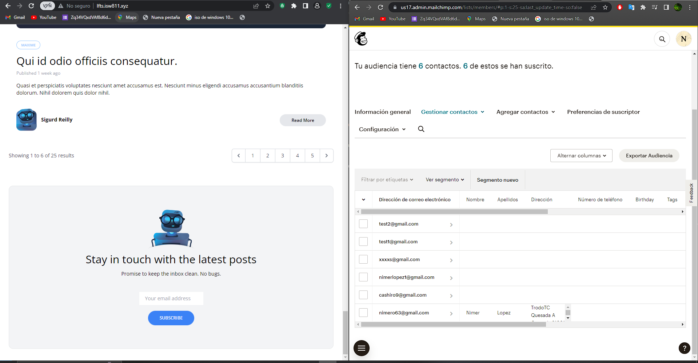

[< Volver al índice](/docs/README.md)

# Cofres de juguetes y contratos

Gracias a esta estructura vamos a tener protegidos nuestros metodos de comunicacion a api de Mailchimp.

## 1 Agregar un constructor a la clase MailchimpNewsletter
Anteriormnete llamada solo Newsletter

```php
    protected ApiClient $client;

    public function __construct(ApiClient $client)
    {
        $this->client = $client;
    }
```
 Este constructor proporciona una forma de inyectar una instancia de ApiClient en la clase y almacenarla en la propiedad protegida $client

## 2 En el archivo AppServiceProvider agrega el siguiente codigo

```php
     public function register()
  {
    app()->bind(Newsletter::class, function () {
      $client = new ApiClient();

      $client->setConfig([
        'apiKey' => config('services.mailchimp.key'),
        'server' => 'us17'
      ]);
      return new MailchimpNewsletter($client);
    });
  } 
```
- app()->bind(Newsletter::class, function ()) Esta línea registra una implementación de la clase Newsletter en el contenedor de servicios de Laravel. Newsletter::class es la representación de cadena de la clase Newsletter. La función bind() establece una resolución concreta para la clase Newsletter, lo que significa que cada vez que se solicite una instancia de Newsletter a través de la inyección de dependencias, Laravel resolverá automáticamente una nueva instancia utilizando la función de retorno proporcionada.

- Se llama al método setConfig() en la instancia de $client. Este método se utiliza para configurar la instancia de ApiClient con la clave de API y el servidor para el servicio de Mailchimp. Los valores se obtienen de la configuración de Laravel utilizando la función config('services.mailchimp.key') para la clave de la API y se establece manualmente el servidor en 'us17'.

- Se devuelve una nueva instancia de la clase MailchimpNewsletter, que toma el objeto $client como argumento. Esta será la implementación concreta de Newsletter que se utilizará cuando se resuelva una instancia de Newsletter en la aplicación.


## 3 Crea una interfaz llamada Newsletter

```php
   interface Newsletter
{
    public function subscribe(string $email, string $list);
} 
```
Todas las clases que esten instanciado a la interfaz estan obligados a tener en su estructura a la funcion subscribe.


## 4 La clase MailchimpNewsletter debe instanciar la interfaz 

```php
    class MailchimpNewsletter implements Newsletter
```
### Quedaria de la siguiente forma
