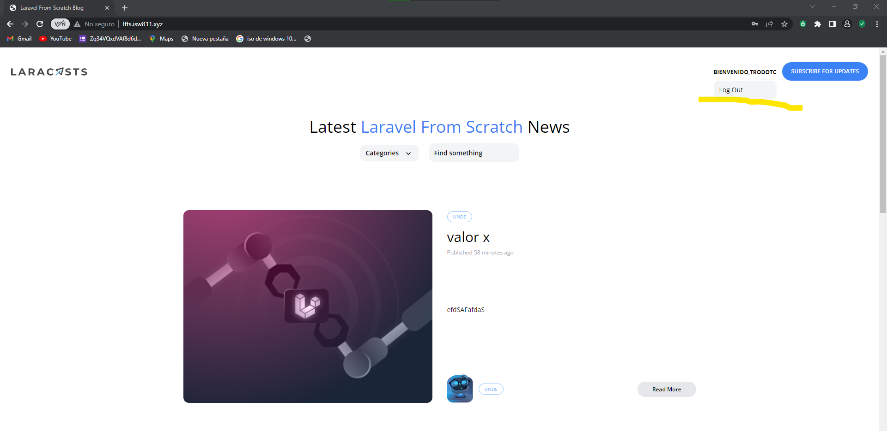

[< Volver al índice](/docs/README.md)

# Todo sobre la autorización

## 1 Borrar el middlawere MustBeAdmin

Tambien lo deb borrar del kernel. Vamos a utilizar un metodo de autorización de usuarios.

## 2 En el archivo AppServiceProvider pega el siguiente codigo.

```php
  Gate::define('admin', function (User $user) {
        return $user->username === 'Nimerxxx';
    });

    Blade::if('admin', function () {
        return optional(request()->user())->can('admin');
    });  
```

### Gate 
- Este código define una política de autorización llamada 'admin'. Se verifica si el nombre de usuario del objeto $user es igual a 'Nimerxxx'. En otras palabras, esta política permite el acceso de administrador solo para el usuario con el nombre de usuario 'Nimerxxx'. Se puede usar esta política en tu código para restringir ciertas acciones o rutas a los usuarios con privilegios de administrador.

### Blade

- Este código define una directiva personalizada en Blade llamada 'admin'. La directiva verifica si el usuario actual, obtenido a través de request()->user(), tiene la capacidad (permiso) de 'admin'. Utiliza la función optional() para manejar el caso en el que no haya un usuario autenticado actualmente. Esta directiva puede ser utilizada en tus plantillas de Blade para mostrar o ocultar contenido específico basado en si el usuario actual tiene el permiso de 'admin'.

## 3 Bloquea del combo la seleccion de las rutas administrativas.
```php
    @admin  
                            <x-dropdown-item
                                href="/admin/posts"
                                :active="request()->is('admin/posts')"
                            >
                                Dashboard
                            </x-dropdown-item>

                            <x-dropdown-item
                                href="/admin/posts/create"
                                :active="request()->is('admin/posts/create')"
                            >
                                New Post
                            </x-dropdown-item>
                            @endadmin 
```


## 4 Remplaza las rutas administrativas del archivo web.
```php
Route::middleware('can:admin')->group(function () {

Route::resource('admin/posts', AdminPostController::class)->except('show');

// Route::get('admin/posts',[AdminPostController::class, 'index']);
// Route::post('admin/posts',[AdminPostController::class, 'store']);

// Route::get('admin/posts/create',[AdminPostController::class, 'create']);
// Route::get('admin/posts/{post}/edit',[AdminPostController::class, 'edit']);
// Route::patch('admin/posts/{post}',[AdminPostController::class, 'update']);
// Route::delete('admin/posts/{post}',[AdminPostController::class, 'destroy']);
}); 
```
Esta ruta genera las rutas CRUD (excepto show) para el controlador AdminPostController relacionadas con los posts de administrador. Tienen una URL base de admin/posts.

### Quedaria de la siguiente forma
