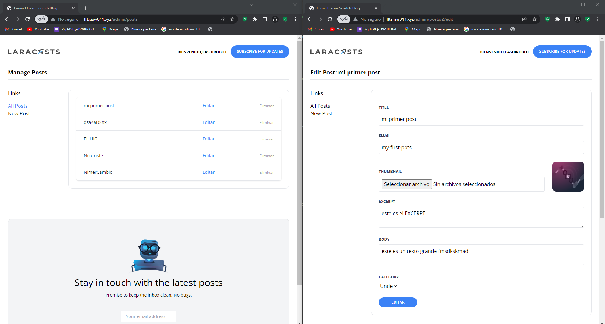

[< Volver al índice](/docs/README.md)

# Crear un formulario para editar y eliminar publicaciones

Es importante tener una forma de editar o eliminar los posts ya sea por algun error o por que ya no llama la atencion.

## 1 Vamos a copiar alguna platilla para mostrar todos los posts.

### 1.1 Crear una vista llamada index.

[Plantillas Aqui](https://tailwindcss.com/docs/table-layout)

Pegar la plantilla en la vista index.

```php
    <x-layout>
    <x-setting heading="Manage Posts">
        <div class="flex flex-col">
            <div class="-my-2 overflow-x-auto sm:-mx-6 lg:-mx-8">
                <div class="py-2 align-middle inline-block min-w-full sm:px-6 lg:px-8">
                    <div class="shadow overflow-hidden border-b border-gray-200 sm:rounded-lg">
                        <table class="min-w-full divide-y divide-gray-200">
                            <tbody class="bg-white divide-y divide-gray-200">
                                @foreach ($posts as $post)
                                    <tr>
                                        <td class="px-6 py-4 whitespace-nowrap">
                                            <div class="flex items-center">
                                                <div class="text-sm font-medium text-gray-900">
                                                    <a href="/posts/{{ $post->slug }}">
                                                        {{ $post->title }}
                                                    </a>
                                                </div>
                                            </div>
                                        </td>

                                        <td class="px-6 py-4 whitespace-nowrap text-right text-sm font-medium">
                                            <a href="/admin/posts/{{ $post->id }}/edit" class="text-blue-500 hover:text-blue-600">Editar</a>
                                        </td>

                                        <td class="px-6 py-4 whitespace-nowrap text-right text-sm font-medium">
                                            <form method="POST" action="/admin/posts/{{ $post->id }}">
                                                @csrf
                                                @method('DELETE')

                                                <button class="text-xs text-gray-400">Eliminar</button>
                                            </form>
                                        </td>
                                    </tr>
                                @endforeach
                            </tbody>
                        </table>
                    </div>
                </div>
            </div>
        </div>
    </x-setting>
</x-layout>
```
Debe tener 2 botones, uno para editar, este debe redireccionar a otra vista y pasar el id de post a modificar. El de elimianr simplemente llamada a un metodo del controlador que elimina mediante el id.

## 2 Crear un nuevo Controlador para administradores.

Ejecuta el siguiernte comando en consola, raiz del proyecto:  php artisan make:controller AdminPostController

## 2.2 Agregar al controlador los metodos que llamen a la vista de crear, editar posts y el de ver todos los posts.

```php
   public function index()
    {
      return view('admin.posts.index',[
        'posts'=>Post::paginate(50)
      ]);  
    }
    public function create()
    {
        return view('admin.posts.create');
    } 
        public function edit(Post $post)
    {
        return view('admin.posts.edit',['post'=>$post]);  
    } 
```
## 3 Crear una replica de la vista create, pero para editar. 
```php
   <x-layout>
    <x-setting :heading="'Edit Post: ' . $post->title">
        <form method="POST" action="/admin/posts/{{ $post->id }}" enctype="multipart/form-data">
            @csrf
            @method('PATCH')

            <x-form.input name="title" :value="old('title', $post->title)" required />
            <x-form.input name="slug" :value="old('slug', $post->slug)" required />

            <div class="flex mt-6">
                <div class="flex-1">
                    <x-form.input name="thumbnail" type="file" :value="old('thumbnail', $post->thumbnail)" />
                </div>

                thumbnail) }}" alt="" class="rounded-xl ml-6" width="100">
            </div>

            <x-form.textarea name="excerpt" required>{{ old('excerpt', $post->excerpt) }}</x-form.textarea>
            <x-form.textarea name="body" required>{{ old('body', $post->body) }}</x-form.textarea>

            <x-form.field>
                <x-form.label name="category"/>

                <select name="category_id" id="category_id" required>
                    @foreach (\App\Models\Category::all() as $category)
                        <option
                            value="{{ $category->id }}"
                            {{ old('category_id', $post->category_id) == $category->id ? 'selected' : '' }}
                        >{{ ucwords($category->name) }}</option>
                    @endforeach
                </select>

                <x-form.error name="category"/>
            </x-form.field>

            <x-form.button>Editar</x-form.button>
        </form>
    </x-setting>
</x-layout> 
```
El formulario ejecuta el metodo del controlador para editar, cada elemento debe cargar  los datos a modificar para mayor accesibilidad.

## 4 Crear el Controlador para editar  

```php
    public function update(Post $post)
    {
        $attributes=request()->validate([
            'title'=>'required',
            'thumbnail'=> 'required|image',
            'slug'=>['required',Rule::unique('posts','slug')->ignore($post->id)],
            'excerpt'=>'required',
            'body'=>'required',
            'category_id'=>['required',Rule::exists('categories','id')]           
        ]);

        if ($attributes['thumbnail'] ?? false) {
            $attributes['thumbnail'] = request()->file('thumbnail')->store('thumbnails');
        }

        $post->update($attributes);

        return back()->with('success', 'Post Updated!');
    }
```
Se validan todos los datos y que el slug pueda ser el mismo y despues se guarda en la base de datos.

## 5 Crear el Controlador para eliminar  

```php

    public function destroy(Post $post)
    {
        $post->delete();

        return back()->with('success', 'Post Deleted!');
    }    
```
Este metodo simplemente elimina el posts y envia un mensaje de verificacion 

### Quedaria de la siguiente forma
