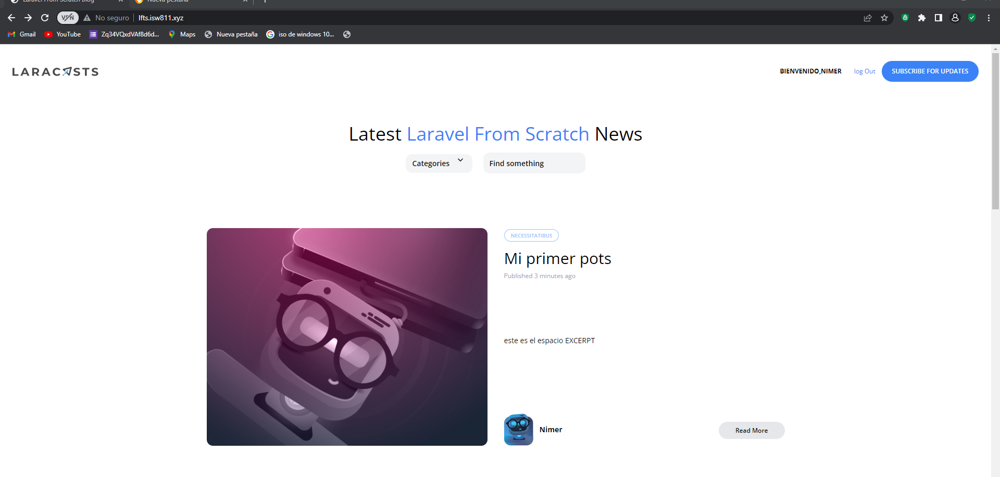

[< Volver al índice](/docs/README.md)

# Crear el formulario de publicación

## 1 Vamos a crear el formulario para ingreso de posts
Utiliza la siguiente plantilla.

```php
    <x-layout>
    <section class="px-6 py-8">
        <x-panel class="max-w-sm mx-auto">
        <form method="POST" action="/admin/posts" enctype="multipart/form-data">
            @csrf
            <div class="mb-6">
                <label for="title" class="block mb-2 uppercase font-bold text-xs text-gray-700">
                    Title
                </label>
                <input class="border border-gray-400 p-2 w-full"
                type="text"
                name="title"
                id="title"
                value="{{old('title')}}"
                required
                >
                @error('title')
                    <span class="text-xs text-red-500">{{ $message }}</span>
                @enderror
            </div>
            <div class="mb-6">
                <label for="category_id" class="block mb-2 uppercase font-bold text-xs text-gray-700">
                    category
                </label>
                <select name="category_id" id="category_id">
                @foreach (\App\Models\Category::all() as $category)
                    @if (!empty(trim($category->name)) && $category->posts->count() > 0)
                        <option 
                            value="{{$category->id}}" {{old( 'category_id' ) == $category->id? 'selected' : '' }}>
                            {{ucwords($category->name)}}
                        </option>
                    @endif
                @endforeach                    
                </select>
                @error('category_id')
                    <span class="text-xs text-red-500">{{ $message }}</span>
                @enderror
            </div>
            

            <x-submit-button>Publish</x-submit-button>
        </form>
        </x-panel>
    </section>
```
Agrega los espacios que sean necesarios para que cumpla con el modelo. 

El select carga la lista de categorias extraidas de la base de datos y los muestra en pantalla.

## 2 Genera una nueva ruta para crear posts

```php
   Route::post('admin/posts',[PostsController::class, 'store'])->middleware('admin'); 
```
Esta ruta tambien debe estar bloqueda para solo administradores.

## 3 Genera el metodo store en el PostsController
```php
        public function store()
    {
        $attributes=request()->validate([
            'title'=>'required',
            'slug'=>['required',Rule::unique('posts','slug')],
            'excerpt'=>'required',
            'body'=>'required',
            'category_id'=>['required',Rule::exists('categories','id')]           
        ]);
        $attributes['user_id']=auth()->id();
        Post::create($attributes);
       
        return redirect('/');
    }  
```
- $attributes=request()->validate([]): Se utiliza el método validate() en el objeto request() para validar los atributos enviados en la solicitud. El método validate() utiliza las reglas de validación definidas en el array proporcionado. Si la validación falla, Laravel automáticamente redireccionará al usuario de vuelta al formulario con los mensajes de error apropiados. Si la validación tiene éxito, los atributos válidos se asignan a la variable $attributes.

- $attributes['user_id']=auth()->id(): Se agrega el user_id al array $attributes para asociar el post con el usuario autenticado. El valor del user_id se obtiene a través del método id() en el objeto auth().

- Post::create($attributes): Se utiliza el modelo Post para crear una nueva instancia del post y se le asignan los atributos validados. El método create() se encarga de insertar el nuevo post en la base de datos.

### Quedaria de la siguiente forma


### El nuevo posts quedaria de la siguiente forma
