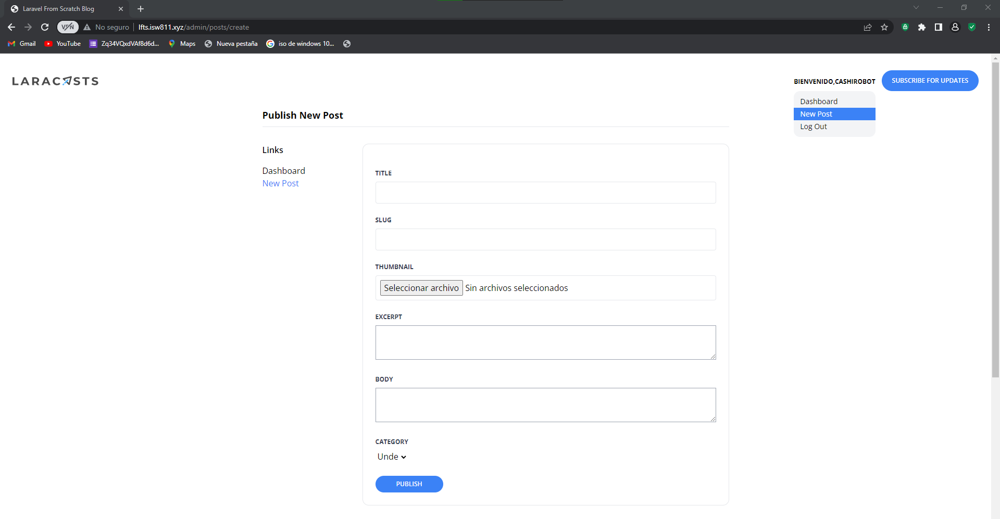

[< Volver al índice](/docs/README.md)

# Ampliar el diseño de administración

Es muy importante que los administradores pudan tener una forma de moverse en la pagina, ya que es muy dificil que ellos se acuerden de la ruta de las areas administrativas.

## 1 Vamos a agregar un menu dropdown para moverse por areas administrativas.
Pegar este codigo en el layout junto a los elementos de inicio de sesion.
```php
    <x-dropdown>
                    <x-slot name="trigger">
                        <button class="text-xs font-bold uppercase">Bienvenido,{{auth()->user()->name}} </button>
                    </x-slot>

                            <x-dropdown-item
                                href="/admin/posts"
                                :active="request()->is('admin/posts')"
                            >
                                Dashboard
                            </x-dropdown-item>

                            <x-dropdown-item
                                href="/admin/posts/create"
                                :active="request()->is('admin/posts/create')"
                            >
                                New Post
                            </x-dropdown-item>
                            <x-dropdown-item
                                href="#"
                                x-data="{}"
                                @click.prevent="document.querySelector('#logout-form').submit()"
                            >
                            Log Out
                        </x-dropdown-item>
                        <form id="logout-form" method="POST" action="/logout" class="hidden">
                            @csrf
                        </form>
    </x-dropdown>
```
Este codigo se va a encargar de generar un menu al darle  click al boton de bienvenido, los componenes ya fueron diseñados el episodios pasados, tambien se modifica el boton de log out ahora esta en el meni al dalr click ejecuta la funcion del formulario.

## 2 Crear un nuevo componente el llamado setting el cual va a contener todo el formulario de ingreso de posts.
### 2.1 Tambien se agrega una lista a la par del formulario para moverse en areas administrativas.

El Dashboard queda pendiente para proximos episodios
```php
    @props(['heading'])

<section class="py-8 max-w-4xl mx-auto">
    <h1 class="text-lg font-bold mb-8 pb-2 border-b">
        {{ $heading }}
    </h1>

    <div class="flex">
        <aside class="w-48 flex-shrink-0">
            <h4 class="font-semibold mb-4">Links</h4>

            <ul>
                <li>
                    <a href="/admin/posts" class="{{ request()->is('admin/posts') ? 'text-blue-500' : '' }}">Dashboard</a>
                </li>

                <li>
                    <a href="/admin/posts/create" class="{{ request()->is('admin/posts/create') ? 'text-blue-500' : '' }}">New Post</a>
                </li>
            </ul>
        </aside>

        <main class="flex-1">
            <x-panel>
                {{ $slot }}
            </x-panel>
        </main>
    </div>
</section>
```
## 3 Modifica el login para que funcione mediante los componentes ya creados.

```php
    <x-layout>
    <section class="px-6 py-8">
        <main class="max-w-lg mx-auto mt-10">
            <x-panel>
                <h1 class="text-center font-bold text-xl">Log In!</h1>

                <form method="POST" action="/login" class="mt-10">
                    @csrf

                    <x-form.input name="email" type="email" autocomplete="username" required />
                    <x-form.input name="password" type="password" autocomplete="current-password" required />

                    <x-form.button>Log In</x-form.button>
                </form>
            </x-panel>
        </main>
    </section>
</x-layout>
```
Tambien va a ayudar a autocompletar.

### Quedaria de la siguiente forma
