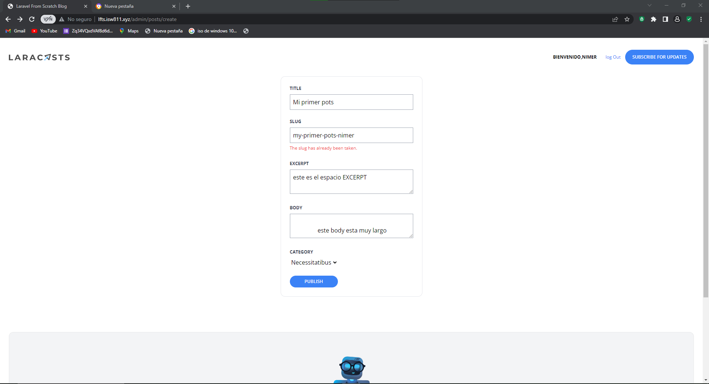

[< Volver al índice](/docs/README.md)

# Extraer componentes de hoja de forma específica
En esta seccion vamos a refactorizar nuestro codigo en componentes blade, asi todo se va a ver mas limpio y vamos a poder reutilizar codigo.

## 1 Dentro de components crear otra carpeta llamada form y dentro de esta un archivo blade llamdo input
Dentro de esta carpeta vamos a tener un input con su respectivo estilo, el cual lo podemos reutilizar en cualquier parete de la pagina web.
```php
@props(['name','type'=>'text'])
<x-form.field>
    <x-form.label name="{{$name}}"/>
    <input class="border border-gray-400 p-2 w-full"
        type="{{$type}}"
        name="{{$name}}"
        id="{{$name}}"
        value="{{old('$name')}}"
        required
        >
        <x-form.error name="{{$name}}"/>
</x-form.field>
```


## 2 Dentro de form crear otro componente llamado label
Este tendra el label donde se indica el nombre el espacio a rellenar dentro del form.

```php
@props(['name'])
<label for="{{$name}}" class="block mb-2 uppercase font-bold text-xs text-gray-700">
        {{ucwords($name)}}
</label> 
```
## 3 Dentro de form crear otro componente llamdado field
Este tendra el estilo de los contenedores de cada elemento del form.

```php
<div class="mt-6">
    {{$slot}}
</div>  
```
## El boton de submit no ya fue creado anteriormente, si lo desea puede moverlo a la carpeta form

## 4 El codigo del combo de categorias quedaria de la siguiernte forma

```php
    <x-form.input name="title"/>
    <x-form.input name="slug"/> 
    <x-form.input name="thumbnail" type="file"/>         
    <x-form.textarea name="excerpt"/>
    <x-form.textarea name="body"/>
     <x-form.field>
                <x-form.label name="category"/>
                <select name="category_id" id="category_id">
                @foreach (\App\Models\Category::all() as $category)
                    @if (!empty(trim($category->name)) && $category->posts->count() > 0)
                        <option 
                            value="{{$category->id}}" {{old( 'category_id' ) == $category->id? 'selected' : '' }}>
                            {{ucwords($category->name)}}
                        </option>
                    @endif
                @endforeach                 
                </select>
                <x-form.error name="category"/>
    </x-form.field>
```
## Todo el codigo de la vista admin, quedaria como se mostro en el codigo anterior.

En este caso no fue necesario crear otro componente para los select, pero igual se reutilizaron algunos componentes ya creados.

### Quedaria de la siguiente forma
