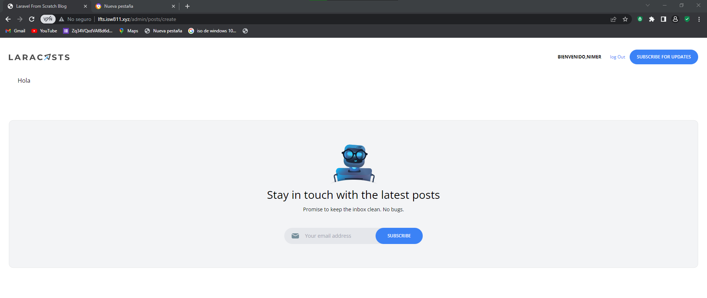

[< Volver al índice](/docs/README.md)

# Limite el acceso solo a los administradores

Es importante que cada pagina tenga su seccion administrativa ya que gracias a esto, el cliente va a poder agregar nuevos posts y no va a depender de un desarrollador.

## 1 Vamos a crear una nueva ruta, para administradores
```php
    Route::get('admin/posts/create',[PostsController::class, 'create'])->middleware('admin');
```
Esta ruta llamda al middleware que valida que es administrador, esto ayuda a tener menos codigo en el controlador y que este mas limpio.
## 2 Crear un middleware para administadores llamado MustBeAdministrator
Ejecuta el siguiente comando en la raiz del proyecto.

```cmd
    php artisan make:middleware MustBeAdministrator
```
## 3 Modifica el middleware con el siguiente codigo.
```php
        public function handle(Request $request, Closure $next)
    {
        
        if (!auth()->user() || auth()->user()->username !== 'Nimerxxx') {
            abort(403);
        }
        
        return $next($request);
    }
```
Este codigo valida que este logueado y que el usuario tenga el nombre del administrador, de caso contrario, saldria un error 403.

## 4 Modifica el kernel para que el middleware este activo.
Agrega el siguiente codigo.

```php
    'admin'=> MustBeAdministrator::class,
```
### Quedaria de la siguiente forma
