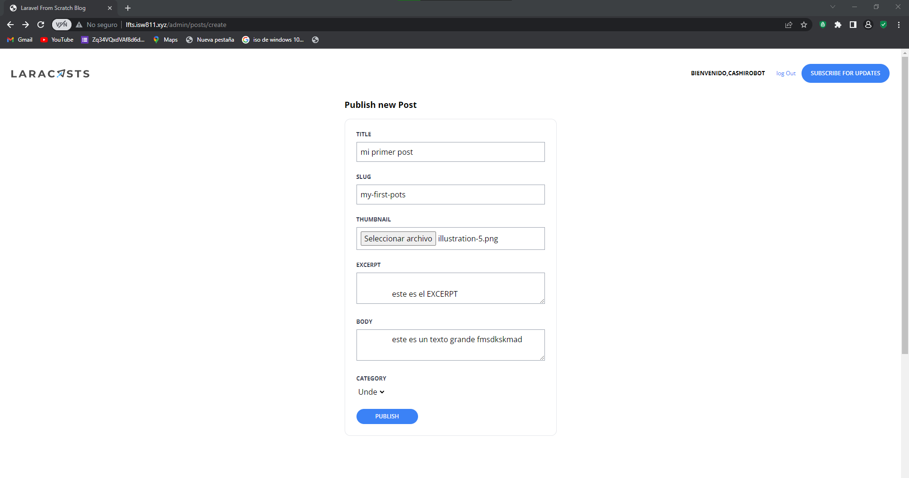
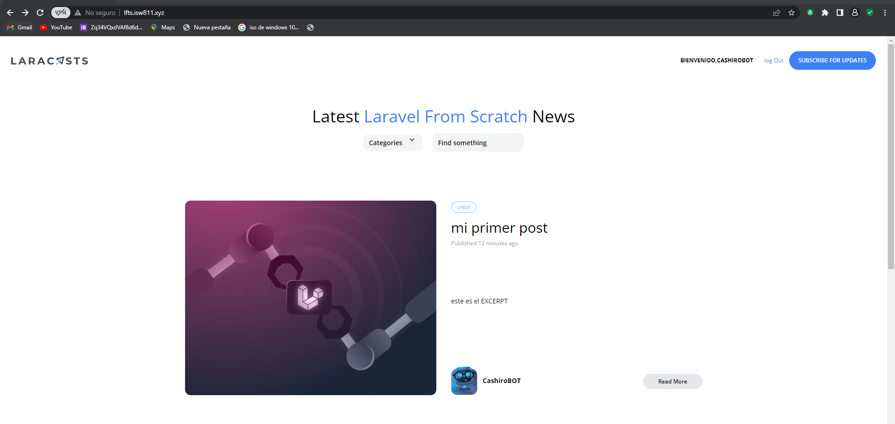

[< Volver al índice](/docs/README.md)

# Validar y almacenar miniaturas de publicaciones

## 1 Implementa un componente input para cargar imagenes al forms
```php
    <div class="mb-6">
                <label for="thumbnail" class="block mb-2 uppercase font-bold text-xs text-gray-700">
                    Thumbnail
                </label>
                <input class="border border-gray-400 p-2 w-full"
                type="file"
                name="thumbnail"
                id="thumbnail"
                value="{{old('thumbnail')}}"
                required
                >
                @error('slug')
                    <span class="text-xs text-red-500">{{ $message }}</span>
                @enderror
    </div>
```


## 2 Modifica el archivo filesystems para que guarde las imagenes en una carpeta public

```php
    'default' => env('FILESYSTEM_DRIVER', 'public'),
```
## 3 Vincula la carpeta storange/public con la /public
Ejecuta el siguiente comando en consola, raiz del proyecto.
```cmd
    php artisan storage:link
```
## 4 Agrega un nuevo atributo al migrador de posts 
```php
    $table->string('thumbnail')->nullable();
```
Este es el atributo donde se guardara la ruta de la imagen.

### Realiza una migracion para que se reflejen los cambios.
```cmd
    php artisan migrate:fresh --seed
```
Este comando borra todos los datos al hacer la migracios y el seed genera 1 datos en la base de datos.

## 5 Modifica el controlador agregando el espacio de la imagen.
```php
       public function store()
    {
       $path=request()->file('thumbnail')->store('thumbnails');

        $attributes=request()->validate([
            'title'=>'required',
            'thumbnail'=> 'required|image',
            'slug'=>['required',Rule::unique('posts','slug')],
            'excerpt'=>'required',
            'body'=>'required',
            'category_id'=>['required',Rule::exists('categories','id')]           
        ]);
        $attributes['user_id']=auth()->id();
        $attributes['thumbnail']=request()->file('thumbnail')->store('thumbnails');
        Post::create($attributes);
       
        return redirect('/');
    }
```
## 6 Cambia el src de todas las imagenes con el siguiente codigo.
```php
    src="/storage/{{$post->thumbnail}}"
```

### Quedaria de la siguiente forma


### La carga de imagenes se veria.
