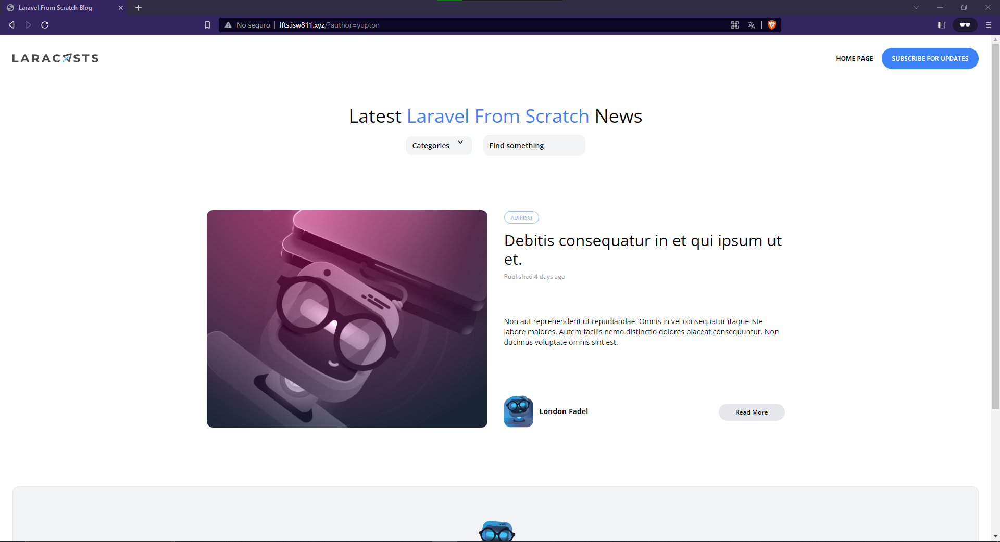

[< Volver al índice](/docs/README.md)
# 39 Restricciones avanzadas de consultas elocuentes

## 1 Modifica el index PostsController agrega el siguiente codigo.

```php
       public function index()
    {
        //dd(request(['search']));
        return view('posts',[
            'posts'=>Post::latest()->filter(request(['search', 'category']))->get(),
            'categories'=>Category::all()
        ]);
    }
```

## En el modelo agrega la siguiente consulta a mysql
```php
     public function scopeFilter($query, array $filters)
    {
       $query->when($filters['search'] ?? false, fn($query, $search)=>
       $query
       ->where('title','like','%' . $search . '%')
       ->orWhere('body','like','%' . $search . '%'));
       
       $query->when($filters['category'] ?? false, fn($query, $category)=>
       $query
        ->whereHas('category',fn($query)=> 
        $query->where('slug',$category))
    ); 
    }
```
En la segunda llamada a when(), se verifica si el filtro 'category' está presente en el array $filters. Si está presente y no es falso, se ejecuta la función de callback. Al igual que antes, la función de callback toma dos parámetros: $query y $category, que representan la instancia de la consulta y el valor del filtro 'category', respectivamente.

Dentro de la función de callback, se utiliza el método whereHas() para aplicar una condición a una relación. En este caso, se verifica si existe una relación de 'category' y, a continuación, se agrega una condición adicional para buscar registros cuyo campo 'slug' coincida con el valor del filtro 'category'.

 este método de alcance permite aplicar filtros de búsqueda y categoría a una consulta. Puedes llamar a este método en tu código para aplicar estos filtros a la consulta actual

## Las rutas quedarian de la siguiernte forma

```php
  Route::get('/',[PostsController::class, 'index'])->name('home');
Route::get('posts/{post:slug}',[PostsController::class, 'show']);

// Route::get('categories/{category:slug}', function (Category $category) {
//     return view('posts',[
//         'posts'=>$category->posts,
//         'currentCategory'=> $category,
//         'categories'=>Category::all()
//     ]);
// })->name('categories');

Route::get('authors/{author:username}', function (User $author) {
    
    return view('posts', [
        'posts' => $author->posts,
        'categories'=>Category::all()
    ]);
});
     
```
Gracias a esto, el codigo esta dividido en en el modelo y el controlador haciendo que nuestro codigo se vea mas limpio y asi poder reutilziar codigo

---

# 40 Extraiga un componente de hoja desplegable de categoría

## 1 Ejecuta en siguiente comando en la raiz del proyecto
Maquina virtual.
```cmd
    php artisan make:component CategoryDropdown   
```
el comando php artisan make:component CategoryDropdown se utiliza en Laravel para generar la estructura básica de un componente Blade. El comando crea una clase en el directorio app/View/Components con el nombre especificado (CategoryDropdown.php en este caso) y una vista Blade en el directorio resources/views/components con el mismo nombre (category-dropdown.blade.php).

El objetivo de este comando es ayudarte a generar rápidamente los archivos necesarios para crear un componente personalizado en tu aplicación Laravel

## 2 En el componente creado pega la estructura deseada
```php
    <x-dropdown> 
    <x-slot name="trigger">
            <button class="py-2 pl-3 pr-9 text-sm font-semibold text-left w-full lg:w-32 flex lg:inline-flex">
                {{ isset($currentCategory) ? ucwords($currentCategory->name) : 'Categories' }}
            </button>                            
    </x-slot>
    <x-dropdown-item href="/" :active="request()->routeIs('home')">All</x-dropdown-item>
        @foreach ($categories as $category)
            <!-- {{ isset($currentCategory) && $currentCategory->is($category) ? 'bg-blue-500 text-white' : '' }}  -->
            <x-dropdown-item href="/?category={{ $category->slug }}"
                :active="request()->is('categories/' . $category->slug)">
                {{ $category->name }}
            </x-dropdown-item>
        @endforeach
</x-dropdown>
```
## En el otro archivo CategoryDropdown.php pega el siguiernte codigo.
```php
        public function render()
    {
        return view('components.category-dropdown',[
            'categories'=>Category::all(),
            'currentCategory'=>Category::firstWhere('slug', request('category'))
        ]);
    }
```
Este código define un componente de Blade CategoryDropdown que se utiliza para mostrar un menú desplegable de categorías, pasando la lista de categorías disponibles y la categoría actual a la vista asociada al componente.

De esta forma lo que se esta haciendo en limpiar mas el codigo ya que ahora el header no tiene el Dropdown en su estructura si no que lo carga de otra vista la cual tiene otro componente que le pasa los datos de esta forma el codigo se ve mas limpio.

Tambien se puede crear otra carpeta llamada posts y que ahi se encuentren los demas componentes.

### Quedaria de la siguiente forma


---

# 41 Filtrado de autores

## 1 Agregar una nueva consulta al modelo posts
```php
        public function scopeFilter($query, array $filters)
    {
       $query->when($filters['search'] ?? false, fn($query, $search)=>
       $query
       ->where('title','like','%' . $search . '%')
       ->orWhere('body','like','%' . $search . '%'));
       
       $query->when($filters['category'] ?? false, fn($query, $category)=>
       $query
        ->whereHas('category',fn($query)=> 
        $query->where('slug',$category))); 

        $query->when($filters['author'] ?? false, fn($query, $author)=>
        $query
         ->whereHas('author',fn($query)=> 
         $query->where('username',$author))); 
    }
```
Esto lo que hace es el filtro por autor

## 2 Agregar al Controlador para que pueda pasar el filtro de autores
```php
        public function index()
    {
        //dd(request(['search']));
        return view('posts.index',[
            'posts'=>Post::latest()->filter(request(['search', 'category','author']))->get()
            
        ]);
    }
```
## 3 Las rutas quedarian de la siguiernte forma
```php
    Route::get('/',[PostsController::class, 'index'])->name('home');
    Route::get('posts/{post:slug}',[PostsController::class, 'show']);
```
### Quedaria de la siguiente forma
