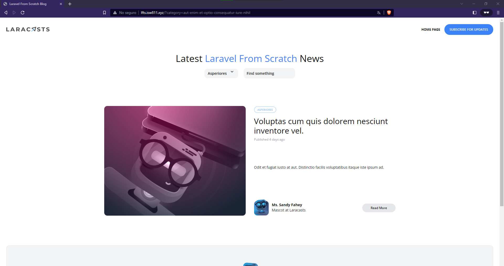

[< Volver al índice](/docs/README.md)
# Restricciones avanzadas de consultas elocuentes

## 1 Modifica el index PostsController agrega el siguiente codigo.

```php
       public function index()
    {
        //dd(request(['search']));
        return view('posts',[
            'posts'=>Post::latest()->filter(request(['search', 'category']))->get(),
            'categories'=>Category::all()
        ]);
    }
```

## En el modelo agrega la siguiente consulta a mysql
```php
     public function scopeFilter($query, array $filters)
    {
       $query->when($filters['search'] ?? false, fn($query, $search)=>
       $query
       ->where('title','like','%' . $search . '%')
       ->orWhere('body','like','%' . $search . '%'));
       
       $query->when($filters['category'] ?? false, fn($query, $category)=>
       $query
        ->whereHas('category',fn($query)=> 
        $query->where('slug',$category))
    ); 
    }
```
En la segunda llamada a when(), se verifica si el filtro 'category' está presente en el array $filters. Si está presente y no es falso, se ejecuta la función de callback. Al igual que antes, la función de callback toma dos parámetros: $query y $category, que representan la instancia de la consulta y el valor del filtro 'category', respectivamente.

Dentro de la función de callback, se utiliza el método whereHas() para aplicar una condición a una relación. En este caso, se verifica si existe una relación de 'category' y, a continuación, se agrega una condición adicional para buscar registros cuyo campo 'slug' coincida con el valor del filtro 'category'.

 este método de alcance permite aplicar filtros de búsqueda y categoría a una consulta. Puedes llamar a este método en tu código para aplicar estos filtros a la consulta actual

## Las rutas quedarian de la siguiernte forma

```php
  Route::get('/',[PostsController::class, 'index'])->name('home');
Route::get('posts/{post:slug}',[PostsController::class, 'show']);

// Route::get('categories/{category:slug}', function (Category $category) {
//     return view('posts',[
//         'posts'=>$category->posts,
//         'currentCategory'=> $category,
//         'categories'=>Category::all()
//     ]);
// })->name('categories');

Route::get('authors/{author:username}', function (User $author) {
    
    return view('posts', [
        'posts' => $author->posts,
        'categories'=>Category::all()
    ]);
});
     
```
Gracias a esto, el codigo esta dividido en en el modelo y el controlador haciendo que nuestro codigo se vea mas limpio y asi poder reutilziar codigo

### Quedaria de la siguiente forma


##

## 4 
```cmd
       
```

## 
```php

```
### 
```php
```

## 
```php
    
```
## 
```php
```

### Quedaria de la siguiente forma
