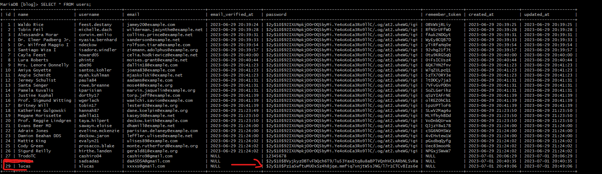

[< Volver al índice](/docs/README.md)

# Hashing automático de contraseñas con mutadores

 Encriptar las contraseñas en la base de datos es una práctica fundamental para proteger la seguridad de los usuarios, evitar accesos no autorizados, cumplir con regulaciones y estándares de seguridad, y generar confianza en los usuarios.

### Vamos a utilizar bcrypt para encriptar las contraseñas en la base de datos

## 1 En el modelo de usuario crea la siguiernte funcion.
```php
        public function setPasswordAttribute($password)
    {
        $this->attributes['password']=bcrypt($password);
    }
```
La función setPasswordAttribute es un mutador en el modelo User. Un mutador se utiliza para modificar el valor de un atributo antes de guardarlo en la base de datos. En este caso, la función setPasswordAttribute se ejecuta automáticamente cuando se establece el valor del atributo password del modelo User.


### Quedaria de la siguiente forma en la base de datos
