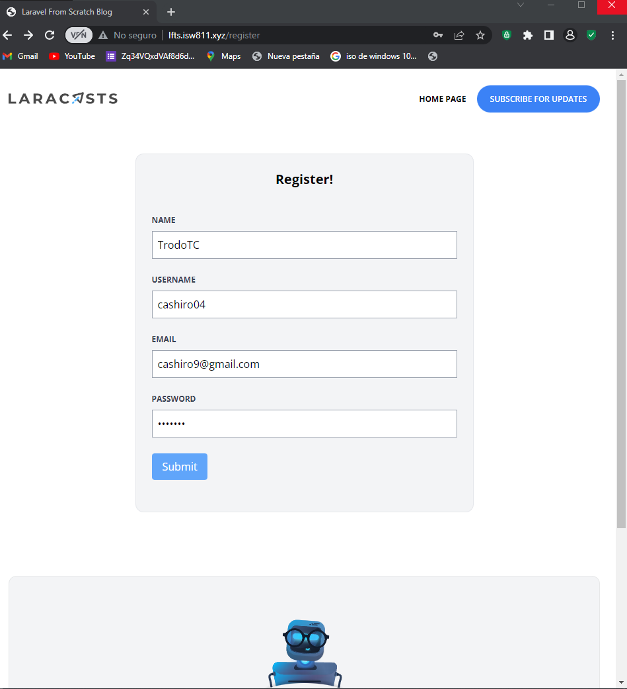

[< Volver al índice](/docs/README.md)

# Crear una página de registro de usuario
En este episodio vamos a crear una nueva vista en el cual vamos a poder registrar usuarios 

## 1 Crear un nuevo controlador para los usuarios con el siguiernte comando 
Escribir este comando en la maquina virtual raiz del proyecto
```cmd
    php artisan make:controller RegisterController
```
## Agrega el siguiernte codigo al controlador
```php
    public function create()
    {
        return view('register.create');
    }
```
Esta ruta lo que va hacer es mostrar la vista donde nos vamos a registrar 

## 2 Crea la vista con la siguiernte estructura
Esto es solo una muestra, modifica la base copiando y modificando los div segun el modelo de usuarios que tengas
```php
    <x-layout>
<section class="px-6 py-8">
    <main class="max-w-lg mx-auto mt-10 bg-gray-100 border border-gray-200 p-6 rounded-xl">
        <h1 class="text-center font-bold text-xl">Register!</h1>
        <form method="POST" action="/register" class="mt-10">
         @csrf   
        <div class="mb-6">
                <label class="block mb-2 uppercase font-bold text-xs text-gray-700"
                    for="name">
                    NAME
                </label>
                <input class="border border-gray-400 p-2 w-full"
                type="text" 
                id="name" 
                name="name"
                required
                > 
            </div>               
            <div class="mb-6">
                <button class="bg-blue-400 text-white rounded py-2 px-4 hover:bg-blue-500">
                        Submit
                </button>
            </div>  
        </form>
    </main>
</section>
</x-layout>
```
 - el formulario de registro captura los datos del usuario y lo envía a la ruta "/register" para su procesamiento(verificar y guadarlo en la base de datos ).

 - la inclusión de @csrf en un formulario de Laravel ayuda a proteger tu aplicación contra ataques de falsificación de solicitudes entre sitios al garantizar que solo se acepten solicitudes legítimas que incluyan el token CSRF correcto.

## 3 Validacion de datos antes de guardar en la base de datos
primero crea la ruta pero en ves de get debe ser post
```php
    Route::post('register',[RegisterController::class, 'store']);
```
### Crea una nueva funcion en el RegisterController que se llame store
```php
       public function store()
    {
        //var_dump(request()->all());
        //return request()->all();
        $attributes=request()->validate([
            'name'=>'required|max:255',
            'username'=>'required|max:255|min:3',
            'email'=>'required|email|max:255',
            'password'=>'required|min:6|max:255'
        ]);
        User::create($attributes);
        return redirect('/');
    }
```
Este codigo verifica que vengan todos los datos y longitudes maximas y minimas que deben tener el User::create($attributes); guarda en la base de datos a la persona y luego lo manda al home

### Quedaria de la siguiente forma
