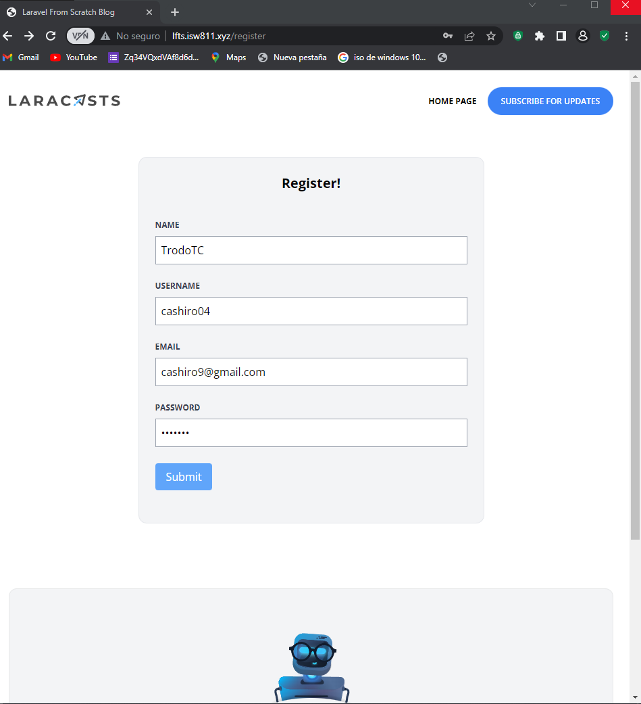

[< Volver al índice](/docs/README.md)

# Crear la página de inicio de sesión

## 1 
```php

```


## 2 

```php
    
```
## 3 
```cmd
    
```


## 4 

```php

```
### Quedaria de la siguiente forma
