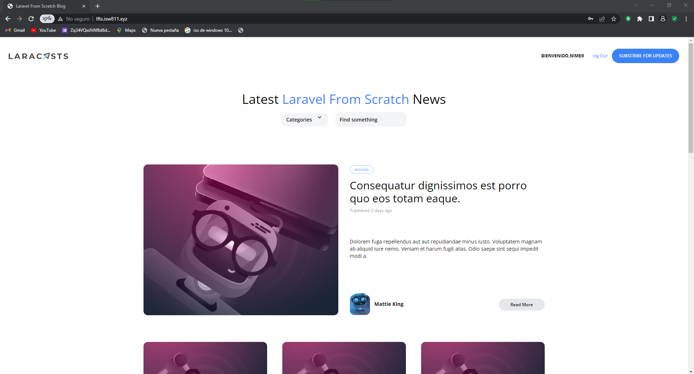

[< Volver al índice](/docs/README.md)

# Iniciar sesión y cerrar sesión

En un sistema informatico es muy importante poder tener una forma de iniciar sesion y cerrar sesion, por ejemplo al estar logueado debe existir algun componente que muestre el nombre del usuario conectado y una forma de que pueda cerrar sesion.

## 1  modificar el RegisterController con el siguiente codigo.
```php
        public function store()
    {
        $attributes=request()->validate([
            'name'=>'required|max:255',
            'username'=>'required|max:255|min:3|unique:users,username',
            'email'=>'required|email|max:255|unique:users,email',
            'password'=>'required|min:6|max:255'
        ]);
        $user=User::create($attributes); 
        auth()->login($user);
        return redirect('/')->with('success','Cuenta creada');
    }
```
Después de crear el nuevo usuario, auth()->login($user); inicia sesión al usuario recién creado. Esto significa que el usuario se autentica y se considera como "logueado" en el sistema.

### En este caso todavia no tenemos un login simplemente cuando se registra se inicia una sesion.

## 2 Modificar el componente layout

```php
    div class="mt-8 md:mt-0 flex items-center">
                @auth
                    <span class="text-xs font-bold uppercase">Bienvenido,{{auth()->user()->name}} </span>
                    <form action="/logout" method="post" class="text-xs font-semibold text-blue-500 ml-6">
                        @csrf
                        <button type="submit">log Out</button>
                    </form>
                @else
                    <a href="/register" class="text-xs font-bold uppercase">Register</a>
                    <a href="/login" class="ml-3 text-xs font-bold uppercase">Log In</a>
                 @endauth
                <a href="#" class="bg-blue-500 ml-3 rounded-full text-xs font-semibold text-white uppercase py-3 px-5">
                    Subscribe for Updates
                </a>
            </div>
```
En este caso se esta validando si esta logueado si es el caso muestra un mensaje de bienvenida mas el nombre en una span, tambien muestra la forma de cerrar sesion. En caso contrario le muestra la forma de registarse o loguearse.

## 3 Crear un nuevo Controlador llamado SessionsController
Debe tener el siguiernte codigo 
```php
        public function destroy()
    {
    auth()->logout();
    return redirect('/')->with('success','Adios');
    }
```
Eeste codigo se encarga de cerrar sesion y mostrar un mensaje de despedida.

## 4 Modificar las rutas para implementar la de logout

```php
    Route::post('logout',[SessionsController::class, 'destroy']);
```
### Quedaria de la siguiente forma
