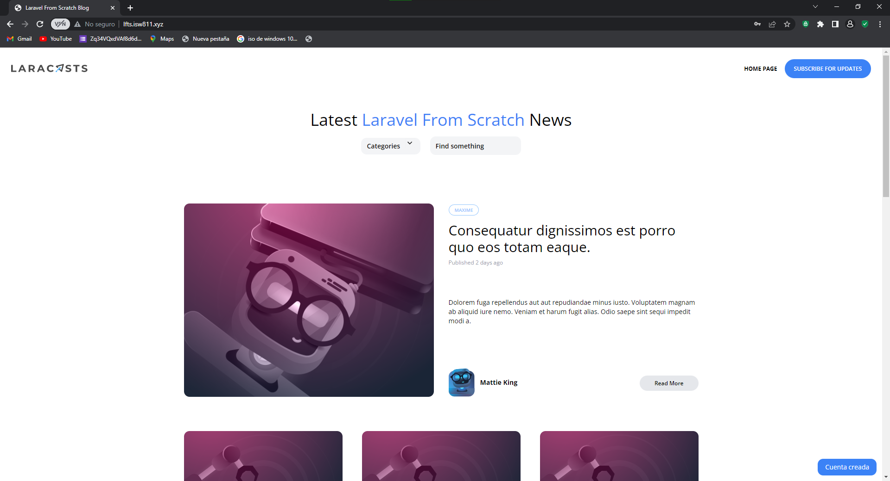

[< Volver al índice](/docs/README.md)

# Mostrar un mensaje flash de éxito

Es muy imporntete mostrale un mensaje al usuario de que su registro fue exitoso ya que gracias a esto se  brinda confirmación y orientación, y reduce la incertidumbre y la frustración. Esto contribuye a una mejor interacción entre el usuario y tu aplicación.

## 1 Modifica el return del RegisterController para que este tambien returne una sesion.
```php
    return redirect('/')->with('success','Cuenta creada');
```


## 2 Crea un componente llamado flash con el siguiernte codigo

```php
    @if (session()->has('success'))
    <div x-data="{ show: true }" x-show="show" class="fixed bg-blue-500 text-white py-2 px-4 rounded-xl bottom-3 right-3 text-sm" x-init="setTimeout(() => { show = false }, 4000)">
        <p>{{ session('success') }}</p>
    </div>
@endif
```
Esto lo que hace en el momento que exista una sesion se mostrara este mensaje el cual tiene una duracion de 4 segundos confirmando la creacion del usuario.

## 3 Modifica el componenete layout al final de este escribe el siguiernte codigo
```php
    <x-flash/>
```
Este hace que se muestre el mensaje en la pagina web

### Quedaria de la siguiente forma
